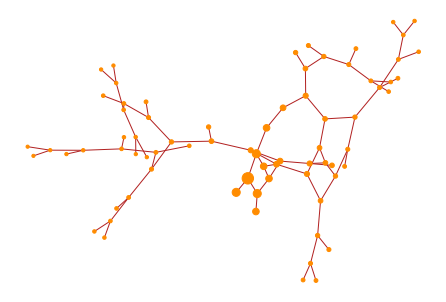
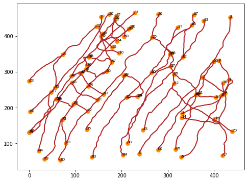
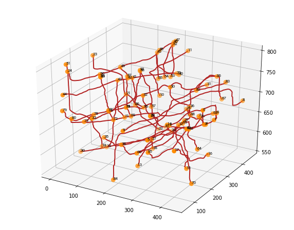
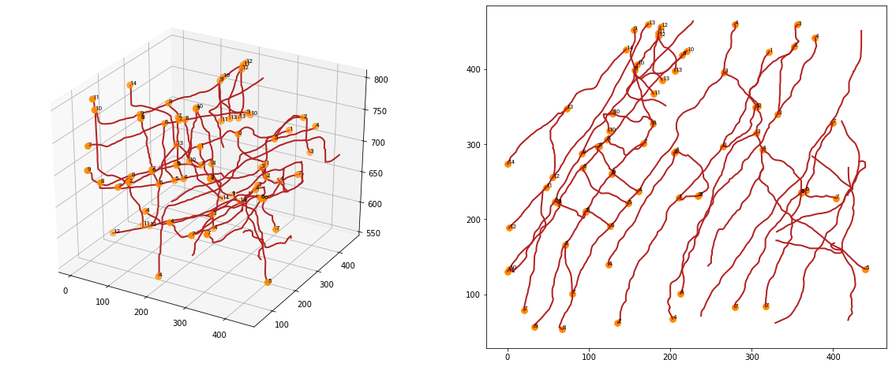
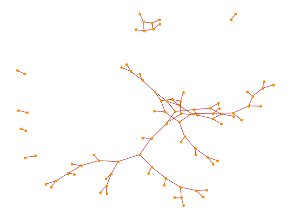

# VesselImage

**VesselImage** 用于将血管或神经造影转化为图，并以此为基础应用一系列图与复杂网络算法。

## 特性
* 载入 ```.hoc``` 文件
* 将 Filament 序列转换为图
* ~~自动消除追踪错误~~
* 给定根节点后，通过广度优先搜索 (BFS) 判断同一连通分支内各点的层级
* 统计各层级的平均路径长度与平均血管粗细
* 若干可视化方法

## 如何安装？
如果以下代码块可以正常运行 (Jupyter快捷键: <Ctrl + Enter>)，说明安装成功；倘若不然，请修复或重新安装 Anaconda.


```python
import numpy as np
import matplotlib.pyplot as plt
from mpl_toolkits.mplot3d import Axes3D
import networkx as nx
from vestools import *
```

## 简单上手
下面是一个简单的流程，包括打开文件、构建网络、确定层级与可视化等步骤。

### 打开并构建


```python
# 从 .hoc 文件获取各连通分支并合并为一个序列列表
comp_dict = get_components('1.hoc')
seq_list = []
for seqs in comp_dict.values():
    seq_list += seqs

# 将序列列表转换为 Filament 对象，自动构建网络
fila = Filament(seq_list)
```

### 可视化选择根节点
获得网络后，我们需要借助可视化方法观察其结构，并人为选择根节点：


```python
# 创建一块画布
fig = plt.figure(figsize=(8, 6))
# 创建一个绘图区域
ax = fig.add_subplot(111)
# 绘图
fila.plot_2d(ax, s=60, color="darkorange")
plt.show()
```





除却 z 轴投影图，我们也可以直接通过三维图像观察网络结构：


```python
# 创建一块画布
fig = plt.figure(figsize=(10, 8))
# 创建一个 3d 绘图区域
ax = fig.add_subplot(111, projection='3d')
# 绘图
fila.plot_3d(ax, s=60, color="darkorange")
plt.show()
```





图中每个数字代表一个节点的编号。在选择了合适的节点后，记住其编号，我们进入下一步：

### 确定层级


```python
# 选择上图中编号为 30 的节点作为根节点
root = 30
# 深度优先遍历，自动分析各节点的层级
fila.dfs(root)

# 绘制层级信息
fig = plt.figure(figsize=(20, 8))
ax1 = fig.add_subplot(121, projection='3d')
ax2 = fig.add_subplot(122)
# True 代表绘制层级信息
fila.plot_3d(ax1, True, s=60, color="darkorange")
fila.plot_2d(ax2, True, s=60, color="darkorange")
plt.show()
```





确定层级后，```Filament``` 对象内将节点们依层级储存在字典 ```fila.layer_dict``` 中。


```python
fila.layer_dict
```


    {0: [FilamentNode(264.51, 297.684, 733.922)],
     1: [FilamentNode(321.452, 423.815, 714.22),
      FilamentNode(210.333, 228.361, 724.815),
      FilamentNode(304.368, 349.352, 676.978)],
     2: [FilamentNode(135.475, 61.7538, 704.947),
      FilamentNode(234.031, 231.234, 677.774),
      FilamentNode(351.922, 431.054, 736.878),
      FilamentNode(307.447, 350.442, 657.385)],
     3: [FilamentNode(204.601, 288.365, 597.685),
      FilamentNode(235.105, 231.616, 676.8),
      FilamentNode(356.112, 459.715, 673.71),
      FilamentNode(331.854, 340.494, 724.326),
      FilamentNode(265.967, 396.012, 653.399),
      FilamentNode(305.693, 315.118, 653.713)],
     4: [FilamentNode(206.258, 290.926, 573.71),
      FilamentNode(124.481, 139.068, 634.566),
      FilamentNode(377.563, 442.297, 723.71),
      FilamentNode(203.101, 67.4659, 563.71),
      FilamentNode(278.99, 460.341, 615.672),
      FilamentNode(160.914, 237.578, 663.941),
      FilamentNode(212.66, 100.693, 642.203),
      FilamentNode(313.127, 293.227, 653.792)],
     5: [FilamentNode(148.242, 221.08, 663.97),
      FilamentNode(128.148, 260.337, 674.227),
      FilamentNode(360.576, 235.869, 664.199),
      FilamentNode(439.604, 133.742, 573.71)],
     6: [FilamentNode(126.492, 190.72, 663.232),
      FilamentNode(92.844, 269.288, 733.31),
      FilamentNode(128.595, 261.447, 674.745),
      FilamentNode(96.5329, 210.867, 673.942),
      FilamentNode(366.196, 238.786, 663.468),
      FilamentNode(360.384, 235.605, 664.267)],
     7: [FilamentNode(79.781, 100.74, 677.156),
      FilamentNode(112.708, 297.214, 733.841),
      FilamentNode(20.7278, 78.5278, 738.87),
      FilamentNode(167.351, 301.189, 668.761),
      FilamentNode(110.663, 296.702, 738.07),
      FilamentNode(95.8531, 210.169, 676.286),
      FilamentNode(399.324, 328.774, 681.389),
      FilamentNode(403.551, 228.298, 623.71),
      FilamentNode(279.08, 82.4549, 637.97),
      FilamentNode(317.1, 83.5713, 645.502)],
     8: [FilamentNode(71.1441, 166.232, 674.555),
      FilamentNode(67.4511, 53.1567, 696.12),
      FilamentNode(122.441, 306.546, 733.409),
      FilamentNode(178.583, 327.323, 664.917),
      FilamentNode(91.5449, 288.097, 760.019),
      FilamentNode(61.8607, 221.848, 749.144)],
     9: [FilamentNode(32.8667, 56.1921, 708.956),
      FilamentNode(214.698, 419.018, 727.682),
      FilamentNode(129.185, 341.404, 741.955),
      FilamentNode(155.437, 452.73, 573.71),
      FilamentNode(155.998, 399.286, 775.829),
      FilamentNode(58.4724, 224.092, 754.501),
      FilamentNode(61.6657, 222.219, 749.47)],
     10: [FilamentNode(220.218, 424.586, 723.865),
      FilamentNode(124.953, 317.741, 663.71),
      FilamentNode(128.942, 341.471, 744.109),
      FilamentNode(159.403, 406.467, 780.239),
      FilamentNode(2.43631, 133.67, 777.183)],
     11: [FilamentNode(185.817, 448.368, 792.484),
      FilamentNode(179.358, 367.356, 723.71),
      FilamentNode(47.3571, 242.852, 567.929),
      FilamentNode(0.114518, 130.404, 794.505)],
     12: [FilamentNode(188.113, 456.962, 793.71),
      FilamentNode(185.391, 444.46, 786.904),
      FilamentNode(55.921, 255.961, 563.764),
      FilamentNode(2.16823, 188.495, 563.71)],
     13: [FilamentNode(205.613, 397.785, 723.71),
      FilamentNode(190.068, 385.795, 723.71),
      FilamentNode(172.988, 460.596, 563.71),
      FilamentNode(72.6287, 347.619, 674.548)],
     14: [FilamentNode(145.753, 426.862, 573.71),
      FilamentNode(0.283928, 273.905, 779.345)]}


### 统计指标

节点由 ```FilamentNode``` 对象表示，```width``` 与 ```length``` 属性分别储存了与当前节点相连的每条路径之平均粗细与平均长度。由此，我们可以得到网络中每一层的平均路径长度与平均粗细：


```python
# python 为我们提供了方便的字典推导式与函数式语法
width_dict = {layer: sum(map(lambda x: np.mean(x.width), nodes)) / len(nodes) 
              for layer, nodes in fila.layer_dict.items()}
length_dict = {layer: sum(map(lambda x: np.mean(x.length), nodes)) / len(nodes) 
              for layer, nodes in fila.layer_dict.items()}

width_dict
```


    {0: 6.5257176278118605,
     1: 6.685329721265334,
     2: 7.547903153292051,
     3: 8.047547791715814,
     4: 7.974693810441937,
     5: 9.10422852522678,
     6: 8.315037106709795,
     7: 7.758543075858233,
     8: 8.563195041242787,
     9: 7.9393906894784925,
     10: 7.0006584253246755,
     11: 6.710516364989179,
     12: 7.045184822496264,
     13: 6.822026489162932,
     14: 6.375960000000001}


### NetworkX 可视化
```networkx``` 是 Python 强大的复杂网络库，提供了各种复杂网络算法与可视化工具。```VesselImage``` 中封装了前者的绘图方法，通过简短的代码即可方便地调用：


```python
plt.figure(figsize=(8, 6))
# 绘制
fila.plot_network()
plt.show()
```





## 代码架构
这部分我写不动了Orz 改天有时间再写... 哪里不明白或者出了 bug 直接问我叭...

溜了溜了


